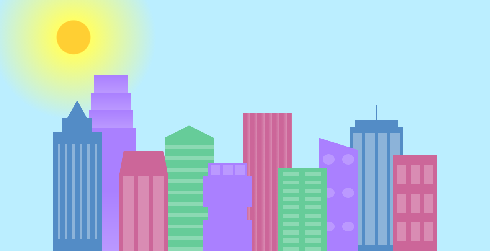
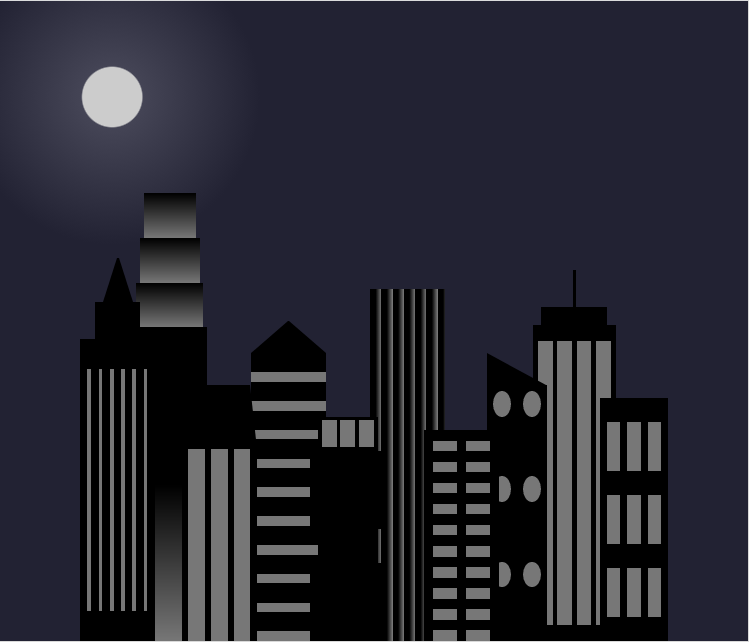

# City_Skyline
 Projetinho criado com a freeCodeCamp usando HTML e CSS - horizonte de uma cidade
 
 O que eu aprendi fazendo esta atividade:
 - uso de variáveis em CSS - :root
 - uso de <strong>borders</strong> com o valor <i>transparent</i> para criar figuras como triângulos
   
 
 <strong>demo:</strong> https://ka-city-skyline.netlify.app/
 
   
 Em telas com resoluções maiores que 800px - paisagem durante o dia
 
 
   
 Como fica em telas com resoluções menores que 800px - paisagem à noite
  
 
 
